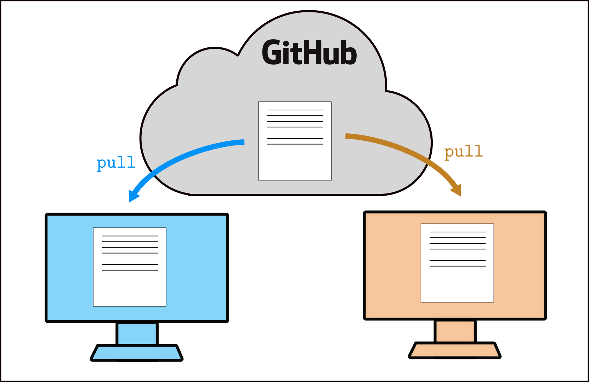
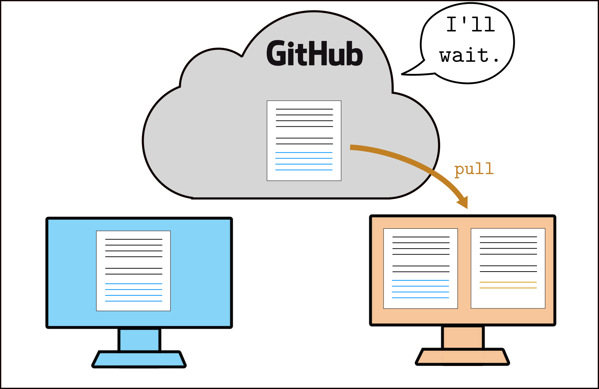

# Week 2 workshop - Fun with sequences

This week, you will practice using lists, loops, and functions in Python by looking at some interesting sequences in mathematics.

Like in Week 1, this week you will pair-program with 1 or 2 other students. In the first exercise, you will learn what is a **merge conflict** and how to resolve it. In the second exercise, you will work together to implement some interesting sequences.

#### Roles

**Driver:** create your codespace (or clone this repo if you use a locally installed IDE). **Navigator**: watch closely and read these instructions to the driver. (You can also create your own codespace now to avoid having to wait later.)

Today, try to **switch roles** every 15 minutes, or every time you finish a part of the task (whichever comes **first**: if you are still working on Task 1 after 15 minutes for example, switch roles anyway, and the navigator will pick up where the driver left off). Every time you switch roles, unless indicated otherwise, this is what you should do:

- the **driver** **saves** the files that have been edited (Ctrl+S or Cmd+S), **stages** their changes, **commits**, and **pushes** to the GitHub repo.
- **after** this, the **navigator** becomes the driver, **pulls** the changes from GitHub, and continues working on the task until the next switch.

If you don't quite remember how to do all this, the navigator can go back to the [Week 1 workshop instructions](https://github.com/pypr23/w01-workshop) and walk the driver through the process.


## Task 1: Generalised Fibonacci sequence

The Fibonacci sequence is a sequence of positive integers, generally starting with the first two values 1, 1. The next number in the sequence is calculated by adding the two previous numbers. The first 10 numbers in the Fibonacci sequence are therefore

1, 1, 2, 3, 5, 8, 13, 21, 34, 55.

Note that each number is the sum of the 2 previous numbers. Mathematically, if we denote by F(n) the nth element of the Fibonacci sequence, we have

F(0) = F(1) = 1,

F(n) = F(n-1) + F(n-2), for n > 1.

We can construct other interesting sequences by generalising this. For example, instead of adding the 2 previous numbers to obtain the next, we can add *multiples* of the 2 previous numbers. If we have two positive integers p and q, let's define a new sequence such that

F(0) = F(1) = 1,

F(n) = p F(n-1) + q F(n-2), for n > 1.

In other words, for this modified Fibonacci sequence, the next number is not calculated as the sum of the 2 previous numbers, but as p times the previous number, plus q times the number before that.

#### Driver:

You will see a script called `fibonacci.py` in your repo. In this file, where indicated, write code to define the following variables:

- a positive integer `p`,
- a positive integer `q`,
- a list `fibo` with 2 elements, `[1, 1]`.

Then, add code to:

- Calculate the 3rd element of the sequence as `p` times the 2nd element, plus `q` times the 1st element.
- Put this number at the end of the list `fibo`.
- Calculate the 4th element of the sequence as `p` times the 3rd element, plus `q` times the 2nd element.
- Put it at the end of the list `fibo`.
- Print the list `fibo` when you are done, it should now have 4 elements.

Check that your code is correct by trying different values of `p` and `q` and checking the results. For example, setting `p = 1` and `q = 1` should give you the first 4 elements of the standard Fibonacci sequence, that is `[1, 1, 2, 3]`. **Navigator**, you can calculate other examples on paper to verify with other values.

> When you are happy with your code, or after around 15 minutes (whichever comes first!), **switch roles**.


## Task 2: Conflict resolution with git

In the Week 1 workshop, the task was written so that driver and navigator would take turns working on the shared code -- this was to avoid **merge conflicts**. A merge conflict happens when two (or more) people modify the same part of the same file, at the same time. Generally, you want to **avoid** merge conflicts -- but sometimes they happen, and it's useful to know how to resolve them. We're going to cause one on purpose.

> If you are working in a group of 3, pick one navigator and follow the instructions for the moment. You can do it again later with the second navigator if you have the time.

- **Driver** and **navigator**, make sure you both have the latest version of your joint work in both your codespaces. If not, the **driver** should push their latest changes, and the **navigator** should pull these changes.
- **Driver** and **navigator**: change the `print()` command you previously used to display the list `fibo`, so that it also displays a sentence that indicates the current value of `p` and `q`. You can do this using an **f-string** for example, as we did in the [Week 1 workshop](https://github.com/pypr23/w01-workshop/blob/main/hello.py).
    - Make sure you **change the existing `print()` command**, on the same line as it is currently; don't add another `print()` above or below it, and don't comment out the original.
    - Make sure you **each write a different sentence**, otherwise there won't be a conflict! It doesn't matter if it's very different or quite similar, as long as it's not exactly the same.
- Both of you should **stage** and **commit** your changes -- **but don't push yet!**.
- **Navigator**: now, push your changes on the GitHub repo. This should work without issues.
- **Driver**: check on the GitHub repo that the navigator's changes are there. Then, **try to push** your changes -- this should fail.

This is what is happening: you both start with the same files.



Then, the driver (orange) and navigator (blue) both make some changes locally, which they stage and commit. Now, each person's version is different from the original (still on GitHub), in a different way. The navigator (blue) pushes their changes, they are incorporated to the original file normally.


Then, the driver (orange) tries to push their changes -- but the original file has changed *at the same place* since the driver last pulled it, so git doesn't know which changes should be kept. This is a conflict.


- **Driver**: you now need to resolve the merge conflict. **Pull** the changes from GitHub, which will now also incorporate the navigator's changes. git will tell you that you need to **resolve the merge conflict** manually.



- **Navigator**: watch closely!
- **Driver:** in your codespace, open the file with the conflict (git should tell you which file it is -- in our case, it should be `fibonacci.py`. You will see something like this:


- **Driver:** your own local changes are between `<<<<<<<< HEAD` and `========`. The navigator's changes (coming from GitHub) are between `========` and `>>>>>>>> ...`. VSCode should display some buttons you can click to directly choose either one or the other; you can also edit the file manually if you want to have a mix of the 2 versions. The important thing is that you remove the **conflict markers** (`<<<<<<<< HEAD`, `========`, and `>>>>>>>> ...`) to indicate that there is no longer a conflict.

- **Driver:** once you're satisfied with the changes, **save** the file, then **stage** and **commit** the changes.
    - Note that the changes appear under "Merge changes" instead of just "Changes", but staging and committing will work exactly the same way.
    - Note that VSCode pre-types a commit message for you here, you can just use it as it is.
    - If the version you chose is your own local one, VSCode should offer you to create an "Empty commit" in a notification in the bottom right; do it. (This is because the code you're trying to commit is exactly the same as what you committed just before, so technically there are no new changes to commit -- but you still have to commit something to indicate to git that the conflict has been resolved.)

Congratulations -- you have now resolved the merge conflict! You can now **push** the changes to GitHub.


- **Navigator**: from your codespace, **pull** the changes from GitHub. You will now see the new changes, where the conflict was resolved by the driver. git doesn't complain here, because it knows that the conflict has been resolved.


#### How can I avoid doing all of this?

The best way to handle merge conflicts is to try to **avoid** them as much as possible. Whenever you start or pick up your work, whenever you start changing files locally, **always start by fetching/pulling** the latest changes from GitHub. While you are working, you can also keep pulling changes regularly, just in case your teammate is also working on the same code at the same time -- this will ensure that if there has to be a merge conflict, it will be smaller and easier to resolve.

And always before pulling, make sure all your own changes are **committed**.

## Task 3: More sequences

If you still have some time today, here are some suggested exercises, to practice loops and functions. If it has been a while since you switched roles, now could be a good time; don't forget to switch roles every 10-15mins in any case.

If you haven't done the sections on **loops** and **functions** in your Week 2 tutorial sheet, then you can work on that together instead, or on the Week 2 Practice quiz questions.

#### 1. Loops

After defining `p` and `q`, define a new variable `N`, a positive integer, and choose a value greater than 2. Then, instead of computing the 3rd and 4th term one-by-one, write a **loop** to calculate the first `N` terms of the sequence (so that the list `fibo` has length `N` after the end of the loop). Here are some example results so you can test your code with different values; use the indicated input values and check that your output matches the below.

```python
# For testing

# Input: p=1, q=1, N=15
# Expected result: [1, 1, 2, 3, 5, 8, 13, 21, 34, 55, 89, 144, 233, 377, 610]

# Input: p=1, q=3, N=15
# Expected result: [1, 1, 4, 7, 19, 40, 97, 217, 508, 1159, 2683, 6160, 14209, 32689, 75316]

# Input: p=2, q=2, N=15
# Expected result: [1, 1, 4, 10, 28, 76, 208, 568, 1552, 4240, 11584, 31648, 86464, 236224, 645376]

# Input: p=6, q=4, N=10
# Expected result: [1, 1, 10, 64, 424, 2800, 18496, 122176, 807040, 5330944]
```

> Don't forget to switch roles if it's time!

#### 2. Functions

Define a **function** `pq_fibo(p, q, N)`, which takes 3 input arguments representing the value of p, the value of q, and the number of terms to compute, and **returns** the list `fibo` containing the first N terms in the sequence.

Test your function using the same examples as above; for example, `print(pq_fibo(1, 1, 15))` should display `[1, 1, 2, 3, 5, 8, 13, 21, 34, 55, 89, 144, 233, 377, 610]`.

Change your function so that it also takes a 4th and a 5th input arguments, `F0` and `F1`, to allow you to compute sequences with different starting values instead of only `[1, 1]`. Write further tests to check your code.

> Don't forget to switch roles if it's time!

#### 3. Golomb sequence (challenging)

Create a new file in the current folder (`w02-workshop-...`), call it `golomb.py`. In this file, write a function `golomb_seq(N)` which takes 1 input argument, an integer `N` greater than 2, and returns all elements of the [Golomb sequence](https://en.wikipedia.org/wiki/Golomb_sequence) which are smaller than or equal to `N`.

Write some tests (i.e., `print(golomb_seq(N))` with different values of `N`) to make sure that your function returns the correct output for different values of `N`.

*Hint:* the sequence starts at n = 1, and the first 3 elements are G(1) = 1, G(2) = 2, and G(3) = 2.

> Don't forget to switch roles if it's time!

(New) driver, in the file `golomb.py`, write a function `golomb_check(n)` which takes 1 input argument, an integer `n` greater than 2, and returns G(n), the `n`th element of the Golomb sequence, calculated explicitly as the nearest integer to 


where Phi is the golden ratio. Compare this value to the `n`th element of the sequence generated by `golomb_seq(N)` -- it should be the same.

